**GOOGLE EARTH ENGINE **

> 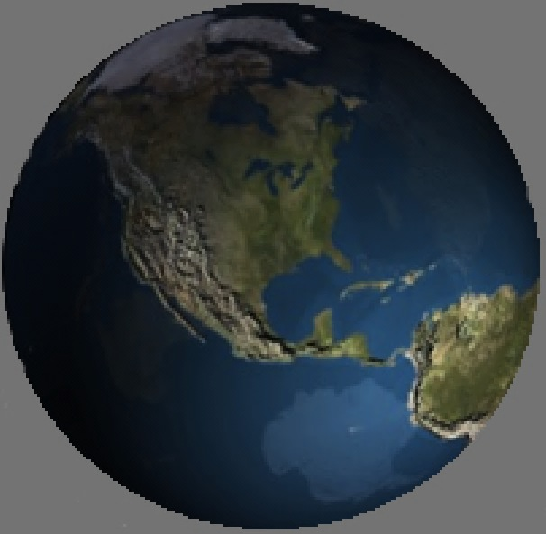**Google Earth Engine**
> (or EE) is one of many computer software applications developed by
> Google, Inc. It is currently an experimental and still-evolving
> platform that is fully accessible only
> 
> to those who have been approved after submitting [this form to
> apply](https://docs.google.com/a/google.com/forms/d/1nsrcvIJlYJSwp-rO4kAyu_yQq0YcaJmShFcmvKTIu9s/viewform).
> 
> 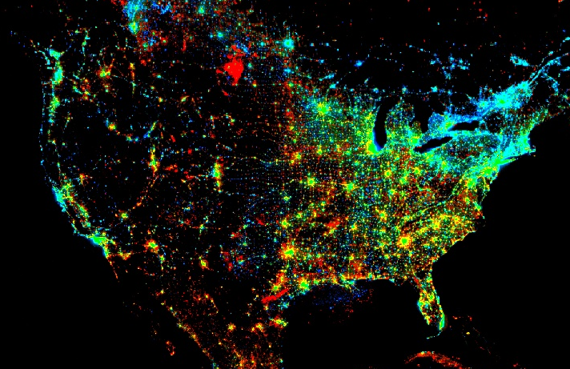
> 
> EE is related to but quite different from a popular application called
> **Google Earth**. Google Earth
> 
> is an Internet-based application for the visualization
> 
> of general-purpose planetary maps and aerial imagery
> 
> (as well as user-supplied cartographic data) in both
> 
> raster and vector formats. Google Earth Engine offers
> 
> capabilities that are oriented much less toward visualization
> 
> *per se* than toward the analysis and synthesis of geographical data.
> 
> It offers access to planetary maps and aerial imagery that are much
> more extensive and considerably more specialized than those
> immediately accessible through Google Earth. These include global and
> sub-global datasets relating to land cover, topographic elevation,
> 
> and meteorological conditions that often range over time as well as
> space.

EE also offers the ability to subject these datasets to analytical and
synthetic operations that detect, measure, identify, characterize, or
otherwise interpret geospatial conditions. Many of these capabilities
are specifically associated with the classification of satellite
imagery, while others are of a more general nature. Most, however, are
oriented toward raster-formatted data.

EE is similar to a geographical information system (GIS) in that it
organizes geospatial data into cartographic layers, each depicting
variation in a particular type of geographical condition. It is also
similar to a GIS in that it provides for the generation of new layers
from existing layers by way of layer-processing operations that

can be combined by using the output of one as input to another.

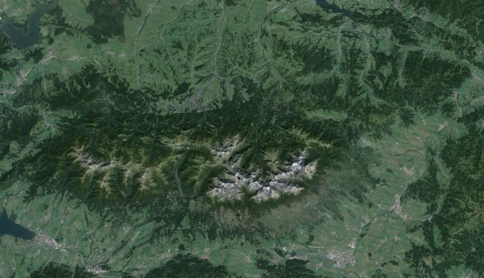

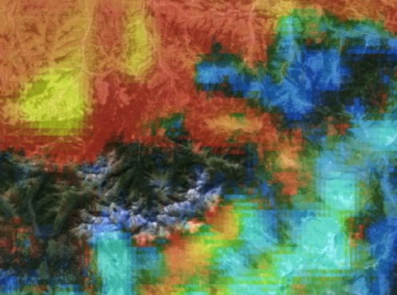EE is different from the typical GIS, however, in
(at least) three conspicuous ways. First, its layers often cover the
entire globe. Second, it processes those layers by utilizing large
numbers of remotely accessed computers simultaneously. And third, the
new layers it generates are seldom stored for subsequent use but instead
merely displayed for immediate inspection. What do get stored are the
sets of instructions required to regenerate those layers.

The result is what amounts to a “lens” that is able to depict a given
location on the Earth’s surface

not only by presenting general-purpose data for that location but also
by presenting special-purpose interpretations of those data and doing so
with enough speed to rapidly browse from one such location to another.
Think of it as a sort of global microscope with optical adjustments that
are able to immediately analyze what’s being seen. Given data on
topographic elevation, for example, such a lens might be set to set to
depict topographic slope, aspect, shaded relief, ridges, valleys,
flood-prone areas, and so on. As this lens is directed toward new
locations, it is constantly processing new topographic data on the fly.

The three major components of Earth Engine are introduced below.
Respectively, these relate to 1) data, 2) data processing, and 3)
data-processing control.

**  
GOOGLE EARTH ENGINE **

DATA

> 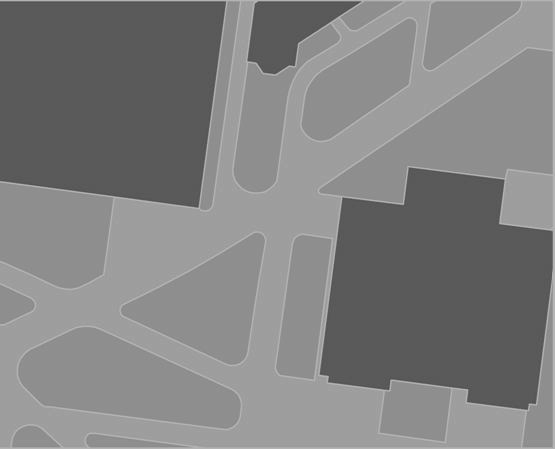Google Earth Engine is designed to process
> geospatial data of particular types and to organize its data in
> particular
> 
> 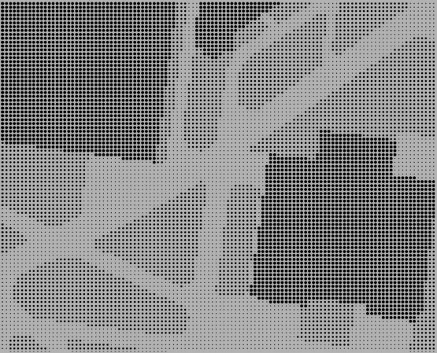 ways.
> 
> All EE data are stored in an online **Data Catalog** maintained by
> Google, where they are accessible in units called
> 
> **Datasets** or **Assets**.
> 
> Here, each dataset is referred to by way of a descriptive
> 
> name (like “Landsat 7 32-Day EVI Composite) and a more
> 
> cryptic **Asset ID** (like “LANDSAT/LE7\_L1T\_32DAY\_EVI).
> 
> Each dataset also has a **Projection** (coordinate system) and may
> include **Metadata** describing its format, its authors, its date, its
> precision, and so on.
> 
> Four major types of dataset are available, including - **Features**,
> 
> \- **Images**,
> 
> \- **Feature Collections**, and
> 
> \- **Image Collections**.
> 
> A **Feature** **Dataset** records geographical conditions as point,
> line, or An **Image Dataset** (or, more simply, an **Image**) differs
> from
> 
> or polygon **geometries** that are associated with recorded
> properties. a feature dataset in much the same way that a photograph
> 
> Feature datasets play only auxiliary roles in Google Earth Engine,
> differs from a drawing. Whereas a feature dataset describes
> 
> which is primarily oriented toward images and image collections. the
> world in terms of points, lines, or polygons, an image
> 
> dataset does so in terms of **Pixels** (“picture elements”).
> 
> 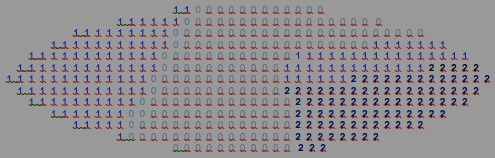A pixel is one of a set of sample locations that
> cover
> 
> a geographical area in a regular pattern of perpendicular
> 
> rows and columns.
> 
> The simplest type of image is one on which each pixel records
> 
> a single numerical **Value** to represent its geographical location,
> 
> and the set of such values for all pixels can be envisioned as
> 
> a “checkerboard” of numbers. **Values** can be stored as integers (of
> signed or unsigned 8-bit, 16-bit, 32-bit, or 64-bit precision) or as a
> floating-point numbers (of single or double precision) as long as all
> values of the same image are of the same type.

The set of all pixels that share a common value is referred to as a
**Region**, which may correspond, for example, to a particular type of
land cover like “softwood forest.”

**  
**

**GOOGLE EARTH ENGINE **

DATA

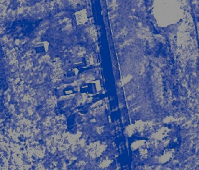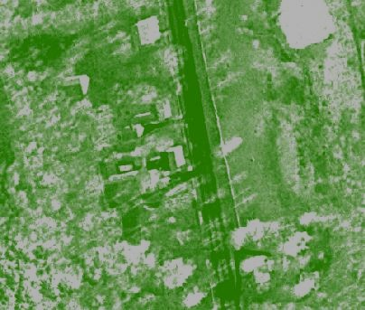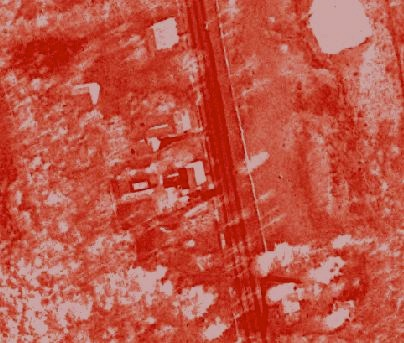A
somewhat more complex type of image is one on which each pixel records
multiple values in order to represent multiple characteristics of its
location. In this case, all pixels of the same image must record the
same number of values, and the set of every pixel’s Nth value is
referred to as one of that image’s **Bands**. An image of this type is
in fact called a **Multiband** image as opposed to the **Singleband**

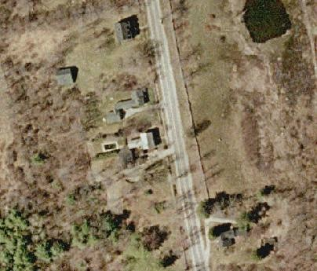image type of image described initially.

Multiband images are often used to store combinations of values
representing the intensities

of different colors, each color being a “band” of wavelengths on the
electromagnetic spectrum and explaining the use of that term. This is
also routinely done in digital color photography

where each pixel’s color is expressed in terms of its redness,
greenness, and blueness.

Since airborne sensors are able to sense and record more bands of
electromagnetic radiation than is the human eye, “multispectral”
satellite images often include more or (in the case of “hyperspectral”
images, many more) bands per image.

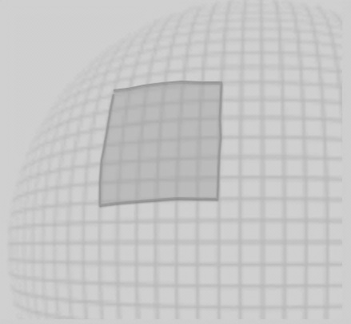Every band of an image is also accompanied by an
auxiliary band called a **Mask** on which

each pixel’s value indicates, on a scale ranging from 0 to 1, the degree
to which that pixel

should be regards as transparent (0), opaque (1), or translucent to a
specified degree (0-1).

Images covering large portions of the globe often stored as a
“patchwork” of adjacent,

rectangular **scenes** that can be accessed individually but are more
often regarded

as part of a seamless “quilt.”

Both features and images can be accessed in groupings called
**collections**, each of which

usually contains datasets that are related to one another by location,
time, and/or content.

Image collections are often used to hold images depicting the same
conditions for the same

> locations but do so at different points in time.

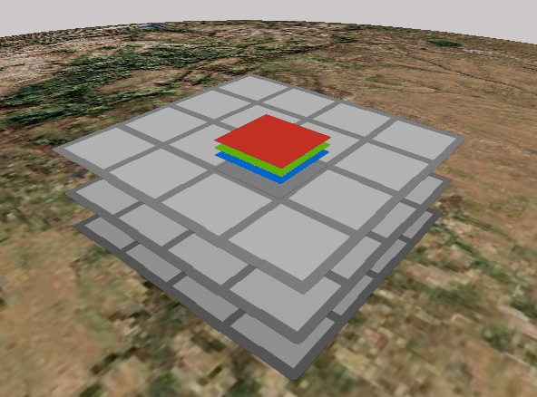

> This type of image collection could be envisioned as comparable to
> 
> \- a set of patchwork quilts (as represented by the three gray
> patchworks to the left),with
> 
> \- each patch (individual gray square) corresponding to a single scene
> that could well include
> 
> \- multiple bands (as shown in red, green, and blue)
> 
> As strained as this quilt analogy may be, it is actually quite
> important that you be able to envision
> 
> the sometimes-complex structure of an image collection, because image
> collections are in fact
> 
> the most common type of dataset employed in Google Earth Engine.

**GOOGLE EARTH ENGINE **

DATA PROCESSING

In order to understand the large and varied set of data-processing
capabilities available through Google Earth Engine, it is useful to
envision those capabilities

in terms of their effects on the transfer of data among four major
environments that are respectively called a **Server**, a **Client**, a
**Disk**, and a **Monitor**.

A Client is a local computer from which a user can access an EE Server,
a local Disk, and a local Monitor.

A Server is a large and powerful data storage and processing facility

that is maintained by Google and generally accessible online.

.

CLIENT

VARIABLES

 DATASETS

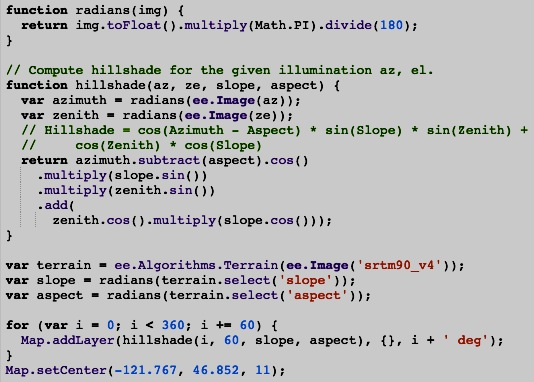Here, geographical data

are organized as Datasets.

Variables can

also be generated

directly from

user input.

DISK

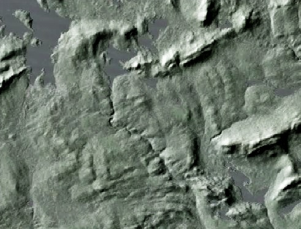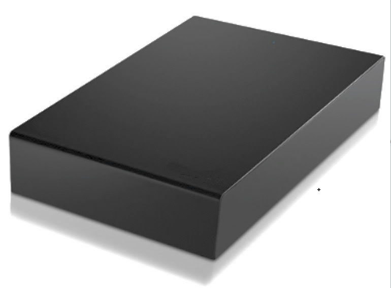Files can

of course also

be generated

independently.

FILES

LAYERS

Here, Layers exported

from a Client can be

saved as Files.

SERVER

Here, Datasets are

represented as Variables.

A large number of

Datasets have

been compiled

by Google.

Datasets can also be generated

by users from certain types of Files.

A Monitor is the local input/output

device accessible to an individual user.

A Disk is the local data storage and retrieval

facility accessible to an individual user.

MONITOR

**Here, Variables maintained by a Client can be
presented **

**in graphic, cartographic, or text format as
Layers.**

**  
GOOGLE EARTH ENGINE **

DATA-PROCESSING CONTROL

Control over the processing capabilities of Google Earth Engine

can be exercised through either of two applications respectively called
the EE [**Graphical Users Interface**
(**GUI**)](EE02%20%20%20The%20EE%20GUI.docx) and

> the EE [**Application Programming Interface
> (API)**](EE05%20%20%20The%20EE%20API.docx) .

Each of these applications operates as a web service and does so best
when accessed using the Google’s **Chrome** web browser (available
[here](https://support.google.com/chrome/answer/95346?hl=en)).

> 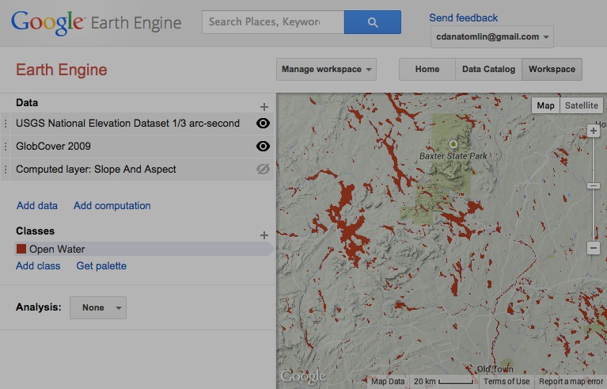The EE GUI offers only a subset of the
> capabilities that are available through the EE API,
> 
> but it offers them in a manner that requires less expertise. Among
> these are capabilities relating to
> 
> \- the **Execution** of instructions and the management of instruction
> sets,
> 
> \- the **Navigation** of geographic space in order to focus the map
> display,
> 
> \- the **Acquisition** of cloud datasets stored presenting them as map
> layers,
> 
> \- the **Generation** of new map layers by uploading disk files or
> reading onscreen input,
> 
> \- the **Computation** of new map layers by way of specified
> operations,
> 
> \- the **Presentation** of map layers onscreen,
> 
> \- the **Reproduction** of map layers as disk files

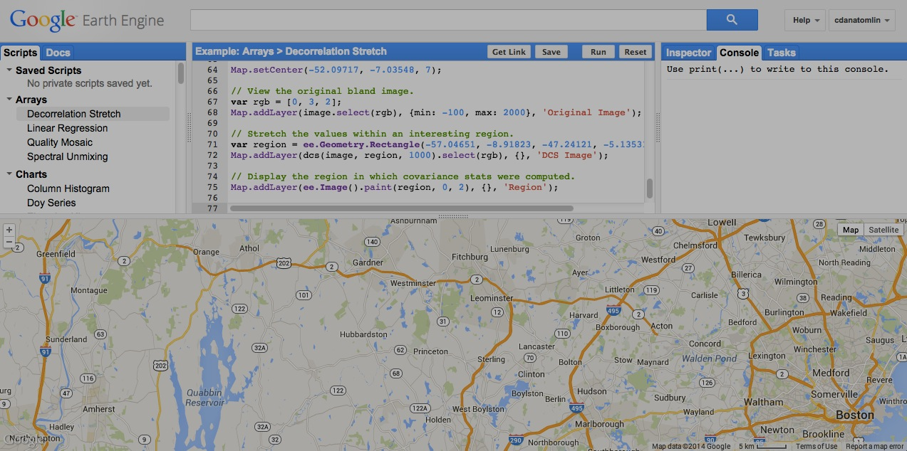

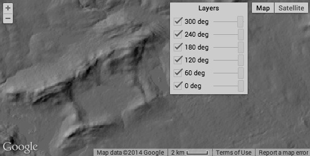

The EE API offers the same types of capability but does so

through either the JavaScript or Python programming languages.

As such, it provides more flexible control over a wider range

of more specialized processing options, but it also requires

familiarity with one of those programming languages.

Like many application programming interfaces, the EE API

is sometimes referred to as a “playground,” and the reasons

for this are significant. Though mastery of its equipment

will indeed require practice, that practice needn’t be

anything but fun, particularly when there are other kids

nearby.
