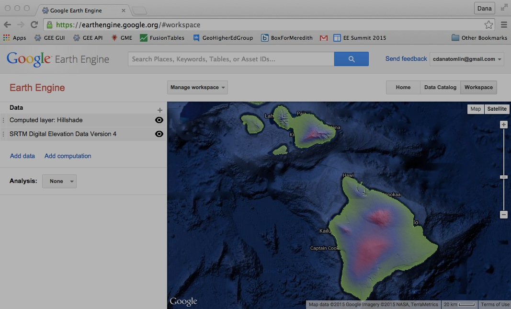

[GOOGLE EARTH ENGINE](EE01%20Earth%20Engine%20\(EE\).docx)
    **GRAPHICAL
USER INTERFACE** 

The **Graphical User Interface** (GUI) of Google Earth Engine (EE) is
its two major applications. In contrast to the other application, EE’s
[**Application Programming
Interface**](OLD%20EE05%20%20%20The%20EE%20API.docx) (API), the GUI is
clearly intended for more casual and introductory use. In that regard,
it serves well to convey the general nature of Earth Engine in
anticipation of later moving to the more challenging but also much more
powerful API.

Like any software application, the EE GUI can be understood in terms of
[**controls**](EE03%20%20%20%20%20%20GUI%20Controls.docx) and its
[**capabilities**](EE04%20%20%20%20%20%20GUI%20Capabilities.docx).

