[GOOGLE EARTH ENGINE](EE01%20Earth%20Engine%20\(EE\).docx)
  [GRAPHICAL USER
INTERFACE](EE02%20%20%20The%20EE%20GUI.docx)

**CONTROLS**

The controls associated with the Graphical User Interface of Google
Earth Engine are organized as a hierarchy of components and
subcomponents as indicated below.

A **Home** Page

> 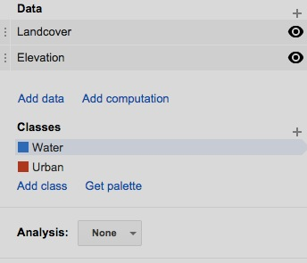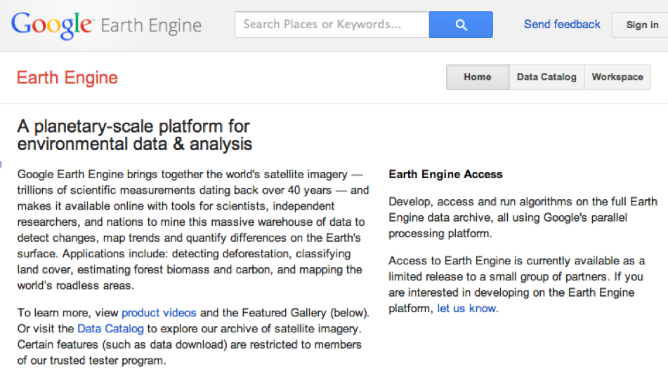 A **Search** Bar
> 
> A **Send Feedback** Button
> 
> A **Sign In** Button
> 
> A **Description** Section
> 
> A **News** Section
> 
> A **Featured Sites** Section
> 
> A **Precomputed Datasets** Section

A **Data Catalog** Page

> 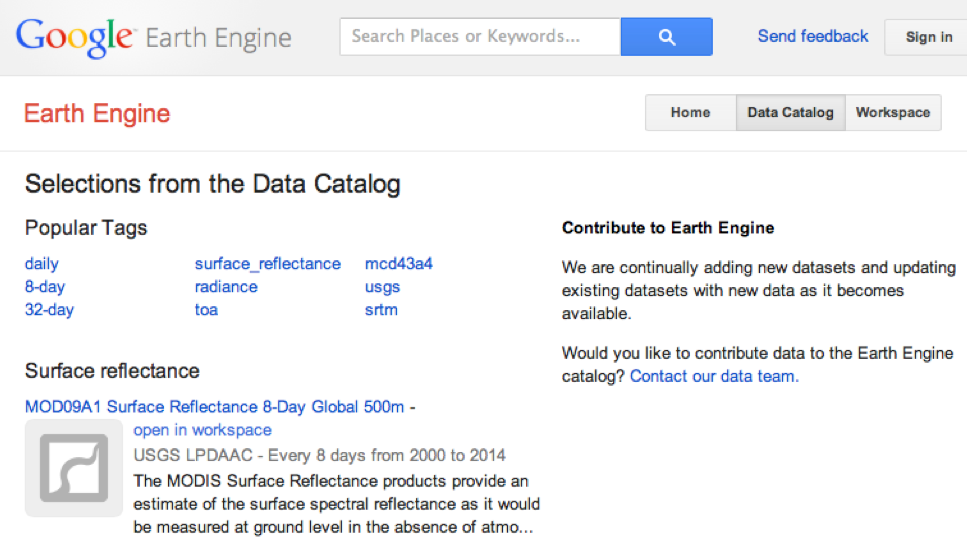 A **Search** Bar
> 
> A **Send Feedback** Button
> 
> A **Sign In** Button
> 
> A **Popular Tags** Section
> 
> A **Data Set** List
> 
> An **Open In Workspace** Button
> 
> A Dataset **Description**
> 
> A **Data Provider**
> 
> A Set of Reference **Tags**
> 
> A Dataset **ID** Number

A **Workspace** Page

> 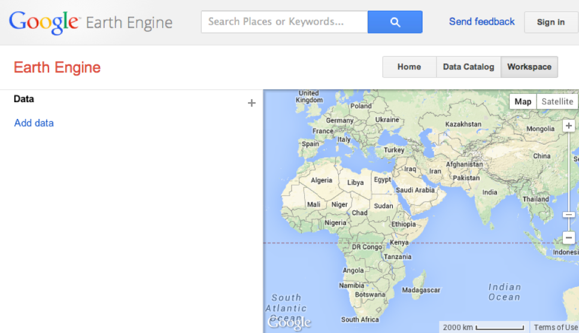 A **Search** Bar
> 
> A **Send Feedback** Button
> 
> A **Sign In** Button
> 
> A **Manage Workspace** Button
> 
> 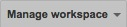A **Save Now** Button
> 
> A **Restore Saved Workspace** Button
> 
> A **Clear Workspace** Button
> 
> An **Import/Export …** Button
> 
> A **Share Workspace …** Button
> 
> A **Display Screen**
> 
> 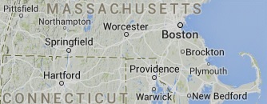 A **Basemap**
> 
> In **Map** Format
> 
> In **Satellite** Format
> 
> A Set of **Layers**
> 
> A **Zoom** Capability
> 
> A **Pan** Capability

A **Control Panel**

> An **Analysis** Section
> 
> A **Data** Section
> 
> An **Add Data** Button
> 
> 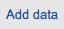
> 
> An **Add Computation** Button
> 
> An **Add Bands** Button
> 
> An **Extract Mask** Button
> 
> An **Apply Mask** Button
> 
> A **Threshold** Button
> 
> An **Expression** Button
> 
> An **Morphology** Button
> 
> A **Convolution** Button
> 
> A **Derivative** Button
> 
> A **Slope and Aspect** Button
> 
> A **Hillshade** Button
> 
> A **Layers**,List
> 
> 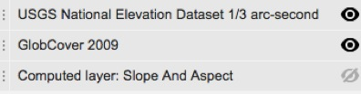A **Drag** Handle
> 
> An **Eyeball** Button
> 
> An Editable **Name**
> 
> A **Layer Settings** Dialog Box
> 
> 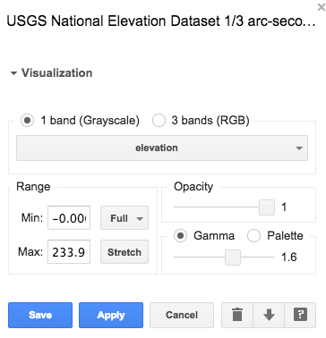 A **View Asset Details** button
> 
> A **Download Layer** button
> 
> A **Delete Layer** button
> 
> A **Cancel** button
> 
> An **Apply** Button
> 
> A **Save** button
> 
> A **Visualization** Panel
> 
> **Band** Controls
> 
> **Range** Controls
> 
> **Opacity** Controls **Color** Controls
> 
> A **Classes** Section
> 
> A **Classes** List
> 
> An Editable **Color** Box
> 
> An Editable **Name** Field
> 
> A **Delete Class** Button
> 
> An **Add Classes** Button
> 
> A **Get Palette** Button

[GOOGLE EARTH ENGINE](EE01%20Earth%20Engine%20\(EE\).docx)
  [GRAPHICAL USER
INTERFACE](EE02%20%20%20The%20EE%20GUI.docx)

[**CONTROLS**](#_top)

> The EE GUI is controlled like most computer applications: by clicking,
> dragging,
> 
> and/or typing in an application window or a pop-up invoked from within
> it.
> 
> This software requires an Internet connection and is accessed by
> navigating
> 
> to <https://earthengine.google.org/#intro> and clicking on the **Sign
> in** button here.
> 
>  The GUI is organized as a set of.
> 
> three web pages respectively called
> 
> **Home**, **Data Catalog**, and **Workspace**.
> 
> .

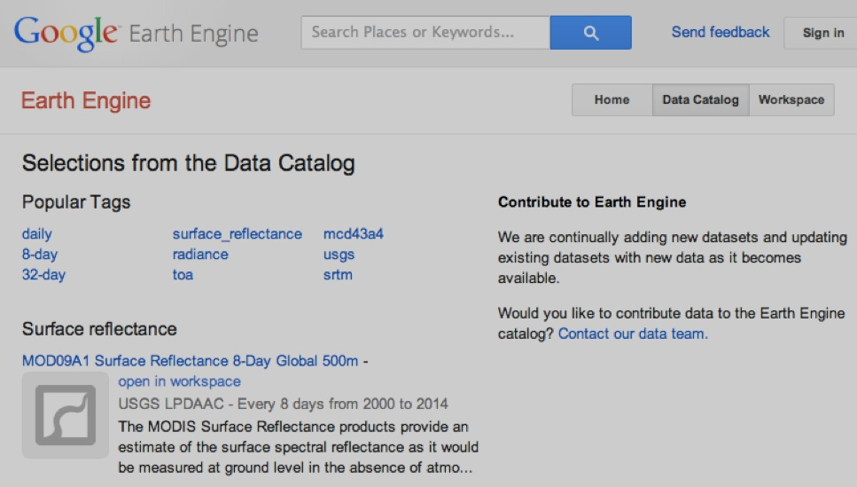

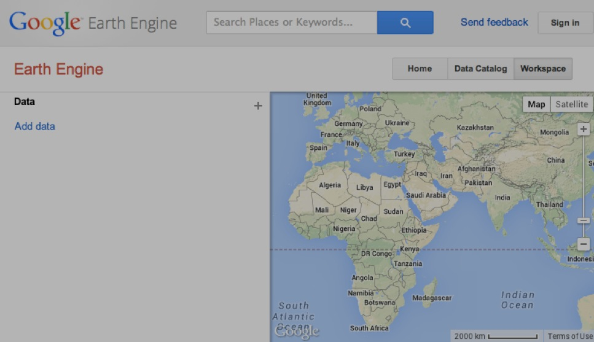

> 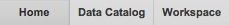Only one of the three pages can be accessed at
> a time, and
> 
> these buttons are used to toggle from one page to another. Each of the
> individual pages is further described below.

**  
**

[GOOGLE EARTH ENGINE](EE01%20Earth%20Engine%20\(EE\).docx)
  [GRAPHICAL USER
INTERFACE](EE02%20%20%20The%20EE%20GUI.docx)

**[CONTROLS](#_top)** ON THE **HOME PAGE**

> In addition to its **Sign in** button, the **Home** page also offers
> 
> a **Search Bar** in which all or part of the name of a location or
> dataset
> 
> 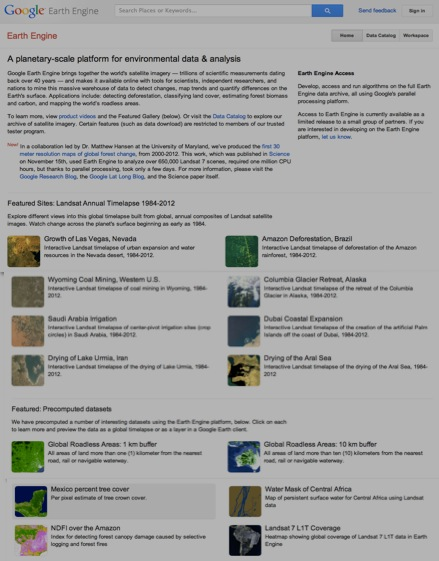 can be specified in order to
> 
> Data can also be added by clicking here
> 
> by clicking
> 
> on “Fusion Table” and specifying a stored fusion table to be loaded;
> 
> or clicking here on “Hand-drawn … ” to screen-digitize sets of points
> or polygons
> 
> Data can also be added by clicking here
> 
> by clicking
> 
> on “Fusion Table” and specifying a stored fusion table to be loaded;
> 
> or clicking here on “Hand-drawn … ” to screen-digitize sets of points
> or polygons
> 
> the select from a listing like this.
> 
> 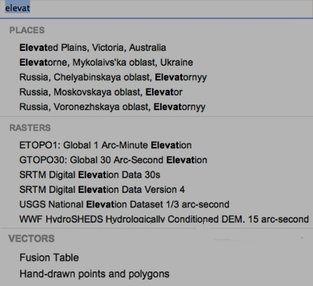
> 
> .
> 
> Any location or dataset selected from this list
> 
> will be displayed on the **Workspace** page.
> 
> The **Home** page also serves to …

\- register user feedback,

> \- introduce the **Graphical User Interface**,
> 
> \- report on current news,
> 
> \- present animations of Landsat satellite imagery from 1984 through
> 2012, and
> 
> \- draw attention to selected sets of generated data.

**  
**

[GOOGLE EARTH ENGINE](EE01%20Earth%20Engine%20\(EE\).docx)
  [GRAPHICAL USER
INTERFACE](EE02%20%20%20The%20EE%20GUI.docx)

**[CONTROLS](#_top)** ON THE **DATA CATALOG PAGE**

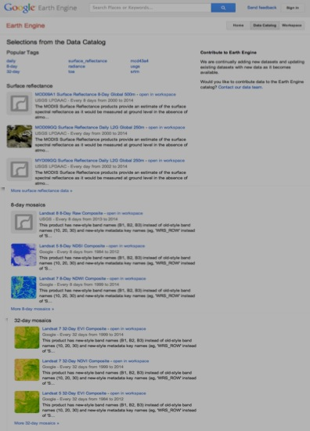

In addition to the same **Search**, **Send feedback**, and **Sign in**
controls

that are available on the **Home** page, the **Data Catalog** page

provides additional controls to locate and load data.

The first of these are presented as a set of links dubbed **Popular
Tags**.

Each opens a listing of dataset names, descriptions,

and links that are much like those that are also listed here.

A click on any of the dataset names will open a new page offering

> \- an **Open in workspace** button will do just that, and

\- a fuller description of the dataset, and

> An **Open in workspace**
> 
> 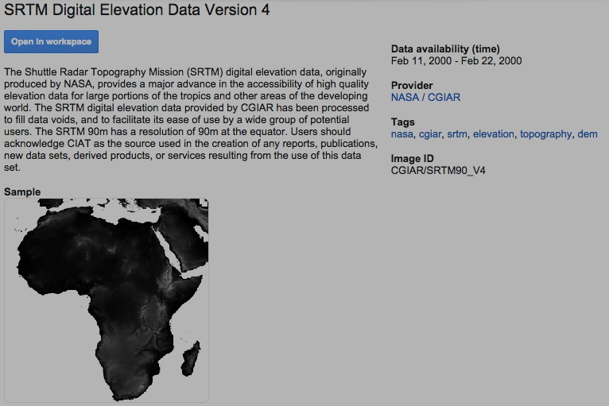button is also presented
> 
> here for each dataset.

This page will also include

\- a link to the dataset’s provider,

\- the dataset’s ID number, and

> \- links to other datasets associated with the same tags.

**  
**

[GOOGLE EARTH ENGINE](EE01%20Earth%20Engine%20\(EE\).docx)
  [GRAPHICAL USER
INTERFACE](EE02%20%20%20The%20EE%20GUI.docx)

**[CONTROLS](#_top)** ON
THE **WORKSPACE PAGE**

At the heart of the Google Earth Engine GUI is the **Workspace** page,
which controls the ability to locate, load, display, describe, and
compute geographical datasets.

Beyond a set of **Search**, **Send feedback**, and **Sign in** controls
like those on the **Home** and **Data Catalog** pages, the **Workspace**
page offers additional controls of

> three different types .
> 
> 
> 
> These are respectively associated with
> 
> \- a **Manage Workspace** tab,
> 
> \- a **Display Screen**, and
> 
> \- a **Control Panel**.

[GOOGLE EARTH ENGINE](EE01%20Earth%20Engine%20\(EE\).docx)
  [GRAPHICAL USER
INTERFACE](EE02%20%20%20The%20EE%20GUI.docx)

**[CONTROLS](#_top)** ON THE **MANAGE WORKSPACE TAB** OF THE [WORKSPACE
PAGE](#WorkspacePage)

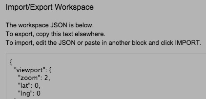A click on the **Manage Workspace** tab will open
a menu of five controls that can be used to

> \- save the current state of the **Workspace** page,
> 
> \- restore the **Workspace** page to its most recently saved state,
> 
>  - set the **Workspace** page to its standard
> (empty) state,
> 
> 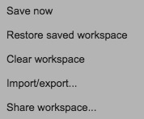 - import or export a text file containing
> 
> the JSON (JavaScript Object Notation)
> 
> code necessary set or record the current
> 
> state of the **Workspace** page, or

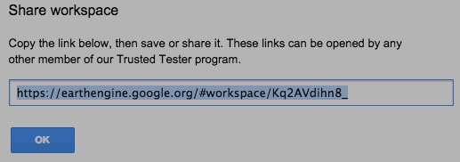

> \- share the current **Workspace** page
> 
> by noting its online address.

**  
**

[GOOGLE EARTH ENGINE](EE01%20Earth%20Engine%20\(EE\).docx)
  [GRAPHICAL USER
INTERFACE](EE02%20%20%20The%20EE%20GUI.docx)

**[CONTROLS](#_top)** ON THE **DISPLAY SCREEN** OF THE [WORKSPACE
PAGE](#WorkspacePage)

The **Display Screen** on the **Workspace** page
operates much like the widely used **Google Maps** application. It will
initially depict a portion of the Earth by way of either topographic
base map or a satellite image according to whichever of these buttons in
its upper-right corner has most recently been clicked.

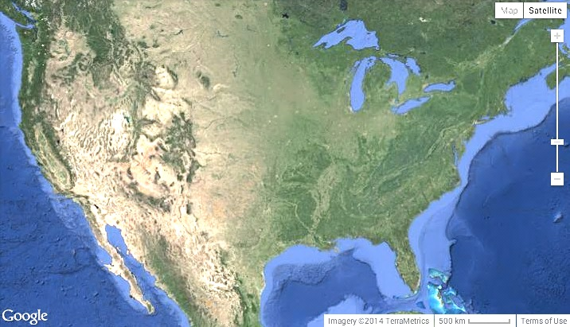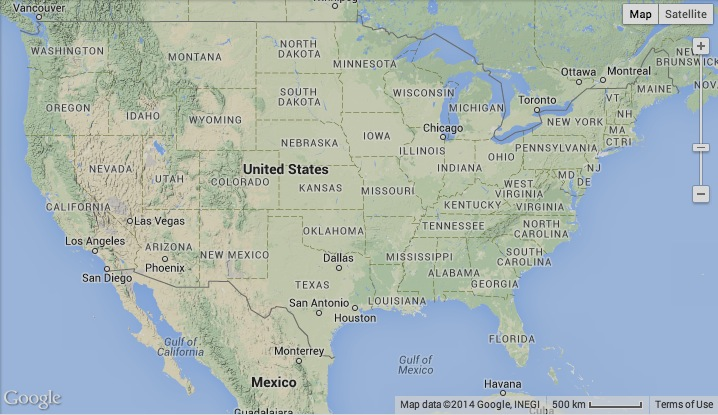

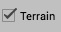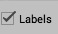By hovering over the
**Map** button and check-marking **Terrain**, By hovering over the
**Satellite** button and check-marking **Labels**,

you can add topographic relief shading to the base map. you can add
labels to the satellite image.

> This slider-bar control in the upper-right
> corner of the **Display Screen**, can be dragged
> 
> \- upward to zoom in on a smaller geographical area and depict it at
> greater detail like this, or
> 
> \- downward to zoom out on a larger area and depict it with less
> detail like this.

The same thing(s) can also be done

> 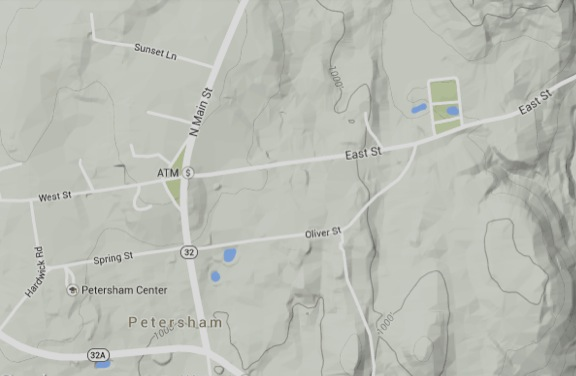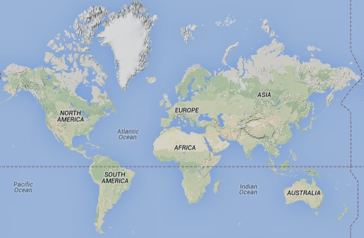 by using a mouse’s
> scroll wheel.

To pan (reposition) the **Display Screen**

> upward, downward, leftward, and/or rightward

in order to depict a different geographical area,

> just click anywhere within it and drag in the
> 
> direction toward which you want to shift the
> 
> current display.

**  
**

[GOOGLE EARTH ENGINE](EE01%20Earth%20Engine%20\(EE\).docx)
  [GRAPHICAL USER
INTERFACE](EE02%20%20%20The%20EE%20GUI.docx)

**[CONTROLS](#_top)** ON
THE **CONTROL PANEL** OF THE [WORKSPACE PAGE](#WorkspacePage)

Just as the **Workspace** page is the most active part of the EE GUI,

its **Control Panel** is the most active part of the **Workspace** page.

The controls offered here enable a user to

\- load and unload data to be processed,

\- indicate those data are to be displayed, and

\- specify computations to be performed using those data.

The **Control Panel** may include as many as three sections:

\- a **Data** section that will always appear at its top,

\- **Classes** section that may appear below that,

depending on the data that have been loaded, and

\- an **Analysis** section will appear below that

appear only for more specialized purposes.

That **Analysis** section offers several special-purpose controls

for the classification of satellite imagery

The **Data** section is of much more general use. It offers both

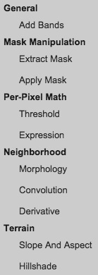an **Add Data** button and a **+** button

> to load data by activating the
> 
> **Workspace** page’s **Search Bar**.

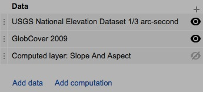 Once loaded, each dataset is added to the top of
a list like

> this where it is referred to as a “**layer**.” Every layer listed
> 
> here is also displayed on the **Display Screen** unless one of
> 
> these buttons is used to render it invisible.
> 
> The order in which layers appear “on top of one another”
> 
> on the **Display Screen** will be the order in which they
> 
> appear in the list. To change this order, just click on the
> 
> far left end of any layer’s list entry and drag it up or down.

This **Add computation** button can also be used to add layers

to the **Workspace** page. Here, however, the layers being

> added are not being read from stored datasets *per se* but are
> 
> being computed with this set of geospatial functions.

The concept of a “computed later” (part noun and part verb) is one the
things that fundamentally distinguishes EE from a conventional GIS.

Rather than store newly computed data, EE more often just stores the
computations necessary to generate such data.

[GOOGLE EARTH ENGINE](EE01%20Earth%20Engine%20\(EE\).docx)
  [GRAPHICAL USER
INTERFACE](EE02%20%20%20The%20EE%20GUI.docx)

**[CONTROLS](#_top)** IN THE **DATA SECTION** ON THE [CONTROL
PANEL](#ControlPanel) OF THE [WORKSPACE PAGE](#WorkspacePage)

> 
> 
> By clicking on the name of a layer in
> 
> the **Control Panel**’s **Data** section, you can open
> 
> a **Layer Settings** dialog box that will offer the ability to

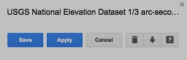

> \- change the layer’s name by clicking on it and editing;

\- change the layer’s appearance on the **Display Screen **

> by using controls that will depend on the nature of that layer
> 
> but which will appear just below it name;
> 
> \- open the **Data Catalog** page to a description of the layer’s
> dataset;
> 
> \- download whatever portion of that dataset is shown on the **Display
> Screen**;
> 
> \- remove the layer from the **Workspace** page; or
> 
> \- close the **Layer Settings** dialog box without saving any unsaved
> changes in layer appearance.
> 
> 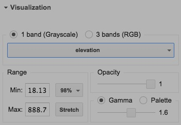This part of the **Layer Settings** dialog box
> 
> usually offers controls that affect a layer’s
> 
> appearance on the **Display Screen**, one
> 
> example of which is illustrated here.
> 
> Whenever these controls are used, their effects
> 
> will be applied to the **Display Screen** only after
> 
> this **Apply** button is clicked. To retain those changes
> 
> and close the **Layer Settings** dialog box, click on
> 
> this **Save** button. The **X** button in the upper right corner of
> the
> 
> **Layer Settings** dialog box can also be used to close it, but only
> 
> after any changes in appearance have been applied.

**  
**

[GOOGLE EARTH ENGINE](EE01%20Earth%20Engine%20\(EE\).docx)
  [GRAPHICAL USER
INTERFACE](EE02%20%20%20The%20EE%20GUI.docx)

**[CONTROLS](#_top)** IN THE **DATA SECTION** ON THE [CONTROL
PANEL](#ControlPanel) OF THE [WORKSPACE PAGE](#WorkspacePage)

The **Layer Settings** dialog box

for a layers of continuous value

will also include a **Visualization** section that

can be opened or closed by clicking here.

This section includes

\- a pair of buttons indicating whether the layer is to

> appear in shades representing the values of a single band

or in a mix of colors representing the values of multiple bands;

> \- a button indicating how multiple bands, if specified
> 
> are to be associated with the colors red, green and blue;

\- a field in which to specify the value to be represented by the color

at the low end of whatever range of colors is to be employed

(such that all lower values are also represented by that color);

\- a field in which to specify the value to be represented by the color

at the high end of whatever range of colors is to be employed

(such that all higher values are also represented by that color);

\- a **Stretch** button that will apply the full range range of colors

> to be employed to the full range values within the area currently
> being displayed on the **Display Screen**;

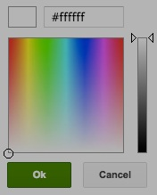- a drop-down menu specifying the range of values
that are to be represented

by the range of colors employed; and

> \- a slider bar indicating how opaque (as opposed to translucent) the
> layer should appear.
> 
> It also includes a pair of buttons indicating whether the color range
> should be defined by **Gamma** values or a **Pallette**.

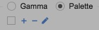 Palettes are specified Gamma values are
specified by way of a slider bar.

> by clicking here These assume a grayscale range of colors and can
> range from

to open a box like - 0, offering greater discrimination among higher
values, to this in which a - 10, offering greater discrimination among
lower values.

a dark-to-light

range of variations

on a particular color are specified. These buttons can then be used to
add or delete additional ranges of color to a palette.

**  
**

[GOOGLE EARTH ENGINE](EE01%20Earth%20Engine%20\(EE\).docx)
  [GRAPHICAL USER
INTERFACE](EE02%20%20%20The%20EE%20GUI.docx)

**[CONTROLS](#_top)** IN THE **CLASSES SECTION** ON THE [CONTROL
PANEL](#ControlPanel) OF THE [WORKSPACE PAGE](#WorkspacePage)

The **Classes** section of the **Control Panel** provides for the
management of what are called “classes.” Each is a specified color and
name that can be used to represent any of the values on one or more
“classified raster” layers. A classified raster is one whose values
represent distinct qualities (such as types of land cover) rather than
continuous quantities (such as topographic elevations).

For example, a class whose name is given as “Water” and whose color is
set to a particular shade of blue might be assigned to whatever values
represents water bodies on one layer entitled “Landcover” and another
entitled “Soils.” Significantly, pixels with values for which no class
has been designated will always appear as transparent on the **Display
Screen**.

> 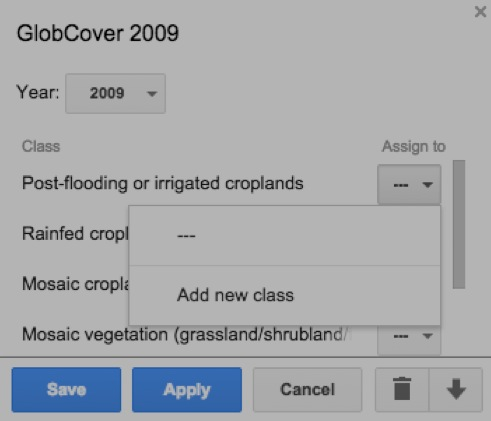To create a new class, you must first add a
> classified raster to the **Workspace** page
> 
> and use its **Layer Settings** dialog box to associate at least one of
> the listed conditions
> 
> it depicts with a new class. To do so,
> 
> \- click here to the right of any of those conditions,
> 
> \- then here to create a new class for that condition, and
> 
> \- then here to retain these settings, close the **Layer Settings**
> box,
> 
> and thereby turn on the **Control Panel** section called **Classes**.
> 
> The new class’s name can then
> 
> 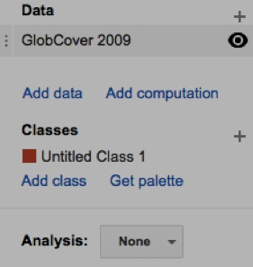 be changed by clicking and editing here.
> 
>  or on the pencil button.
> 
> 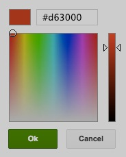
> 
> And by clicking on the class’s color box,
> 
> a new color can also be chosen for
> 
> the class from a color-selection box like
> 
> this. *(Note, however, that a change in the*
> 
> *color of a condition’s class will be noted only*

*after that class is reassigned to the condition.)*

> Additional classes can be added
> 
> by clicking on either of these two buttons,

and each can be deleted with its **X** button.

The Classes section will appear

in the Control Panel only when

at least one classified raster layer

is present in the Workspace.

Whenever the Classes section

disappears (for lack of such a layer)

and then reappears (when one is

later added), however, its most

recent state will be restored.

The Classes section will appear

in the Control Panel only when

at least one classified raster layer

is present in the Workspace.

Whenever the Classes section

disappears (for lack of such a layer)

and then reappears (when one is

later added), however, its most

recent state will be restored.

> The set of colors associated with all
> 
> of the classes established for a particular
> 
> workspace is referred to as the workspace’s “palette,” and this **Get
> Pallette** button

can be used to present that palette by listing the numerical identifiers
for each of its colors.
