# Google Earth Engine Example Series

This document is part of the [Google Earth Engine Example Series](../01_earth_engine/), 
an introduction to the [objects](../13_variables/) and [capabilities](../07_capabilities/) of Earth Engine's [API](../05_the_ee_api/).
The series was originally crafted by Dana Tomlin for the *Geospatial Software Design* course at the Yale School of Forestry and Environmental Studies.


## PROCESSING **NUMBER** VARIABLES

A number is an EE [variable object](../13_variables/) that represents a quantity. Numbers
can be processed by using operations of the types listed below, which
vary according to the nature of that processing. Each operation name is
linked to a separate page describing that
operation.

|  Utility                                 |        API Calls                                            |                                                  |                                            |                                              |
| --------------------------------- | -------------------------------------------------- | ------------------------------------------------ | ------------------------------------------ | -------------------------------------------- |
| **CREATING** NUMBERS              |                                                    |                                                  |                                            |                                              |
|                                   | [ee.Number](#number)                               |                                                  |                                            |                                              |
| **EDITING** NUMBERS               |                                                    |                                                  |                                            |                                              |
|  - BY **RECASTING** DATA TYPES       | [number.uint16](#uint16)                           | [number.Uint16](#uint16)                         | [number.uint32](#uint32)                   | [number.Uint32](#uint32)                     |
|                                   | [number.uint8 ](#uint8_)                           | [number.Uint8](#uint8_)                          |                                            |                                              |
|                                   | [number.int8](#uint8_)                             | [number.toInt8](#uint8_)                         | [number.byte ](#uint8_)                    | [number.toByte](#uint8_)                     |
|                                   | [number.int16 ](#uint8_)                           | [number.toInt16](#uint8_)                        | [number.short ](#uint8_)                   | [number.toShort](#uint8_)                    |
|                                   | [number.int32 ](#uint8_)                           | [number.toInt32](#uint8_)                        | [number.int](#uint8_)                      | [number.toInt](#uint8_)                      |
|                                   | [number.int64 ](#uint8_)                           | [number.toInt64](#uint8_)                        | [number.long ](#uint8_)                    | [number.toLong](#uint8_)                     |
|                                   | [number.float ](#uint8_)                           | [number.toFloat](#uint8_)                        | [number.double](#uint8_)                   | [number.toDouble](#uint8_)                   |
| **TRANSFORMING** NUMBERS          |                                                    |                                                  |                                            |                                              |
|  - WITH **LOGICAL** OPERATIONS       | [number.eq](#eq_neq_)                              | [number.gt](#eq_neq_)                            | [number.lt](#eq_neq_)                      | [number.and](#and_or)                        |
|                                   | [number.neq](#eq_neq_)                             | [number.gte](#eq_neq_)                           | [number.lte](#eq_neq_)                     | [number.or](#and_or)                         |
|                                   | [number.not](#not)                                 |                                                  |                                            |                                              |
|  - WITH **MATHEMATICAL** OPERATIONS  | [number.abs](#abs_round_)                          | [number.ceil](#abs_round_)                       | [number.floor](#abs_round_)                | [number.log](#abs_round_)                    |
|                                   | [number.round](#abs_round_)                        | [number.sqrt](#abs_round_)                       | [number.exp](#abs_round_)                  | [number.log10](#abs_round_)                  |
|                                   | [number.add](#add_subtract_)                       | [number.subtract](#add_subtract_)                | [number.multiply](#add_subtract_)          | [number.divide](#add_subtract_)              |
|                                   | [number.max](#add_subtract_)                       | [number.min](#add_subtract_)                     | [number.mod ](#add_subtract_)              | [number.pow](#add_subtract_)                 |
|                                   | [number.hypot](#add_subtract_)                     | [number.first](#add_subtract_)                   | [number.first\_nonzero](#add_subtract_)    |                                              |
|  - WITH **TRIGONOMETRIC** OPERATIONS | [number.sin](#sin_cos_)                            | [number.cos](#sin_cos_)                          | [number.tan](#sin_cos_)                    |                                              |
|                                   | [number.sinh](#sin_cos_)                           | [number.cosh](#sin_cos_)                         | [number.tanh ](#sin_cos_)                  |                                              |
|                                   | [number.acos](#sin_cos_)                           | [number.asin](#sin_cos_)                         | [number.atan](#sin_cos_)                   | [number.atan2](#atan2)                       |
|  - WITH **BITWISE** OPERATIONS       | [number.bitwiseAnd](#bitwiseAnd_Or_)               | [number.bitwiseOr](#bitwiseAnd_Or_)              | [number.bitwise\_xor](#bitwiseAnd_Or_)     | [number.bitwiseNot](#bitwiseAnd_Or_)         |
|                                   | [number.bitwise\_and](#bitwiseAnd_Or_)             | [number.bitwise\_or](#bitwiseAnd_Or_)            | [number.bitwiseXor](#bitwiseAnd_Or_)       | [number.bitwise\_not](#bitwiseAnd_Or_)       |
|                                   | [number.leftShift](#leftShift_rightShift)          | [number.left\_shift](#leftShift_rightShift)      | [number.rightShift](#leftShift_rightShift) | [number.right\_shift](#leftShift_rightShift) |
|                                   |                                                    |                                                  |                                            |                                              |
| **COMPARING** NUMBERS             | [ee.Algorithms.IsEqual](#IsEqual)                  |                                                  |                                            |                                              |
|                                   |                                                    |                                                  |                                            |                                              |
| **DOCUMENTING** NUMBERS           | [ee.Algorithms.Describe](#Describe_String_getInfo) | [ee.Algorithms.String](#Describe_String_getInfo) |                                            |                                              |
|                                   | [number.GetInfo](#Describe_String_getInfo)         | [number.toString](#toString_serialize)           | [number.serialize](#toString_serialize)    |                                              |
| **PRESENTING** NUMBERS            |                                                    |                                                  |                                            |                                              |
|  - IN **PRINT**                      | [print(number)](#touint32)                    | [console.log(number)](#print_console)            | [alert(number) ](#alert_confirm)           | [confirm(number)](#alert_confirm)            |
|                                   |                                                    |                                                  |                                            |                                              |


### **CREATING** NUMBER VARIABLES

<a name="number" href="#number">#</a> *ee*.**Number**() [<>](https://developers.google.com/earth-engine/api_docs#eenumber "Google API docs")

ee.Number creates a new number from a specified sequence of numeral
characters.

```js
newNumber = ee.Number( characters )
```

`characters` is the specified sequence of characters  \
`newNumber` is the new number

```js
var TheNUMBER = ee.Number( 123 );  
print( TheNUMBER );
```


**  
**

### **EDITING** [NUMBER](#_top) [VARIABLES](EE13%20%20%20%20%20%20%20%20%20Variables.docx) BY **RECASTING** DATA TYPES

Each of these operations replicates a specified number (of any numerical
type) to create a new one whose pixel type is as indicated below.

<a name="uint32" href="#uint32">#</a> *Number*.**uint32**() [<>](https://developers.google.com/earth-engine/api_docs#eenumberuint32 "Google API docs")  \
<a name="touint32" href="#touint32>#</a> *Number*.**toUint32**()

Outputs an unsigned 32-bit integer

<a name="uint16" href="#uint16>#</a> *Number*.**uint16**() [<>](https://developers.google.com/earth-engine/api_docs#eenumberuint16 "Google API docs")  \
<a name="touint16 href="#touint16">#</a> *Number*.**toUint16**()

Outputs an unsigned 16-bit integer

[**\#**](#number) *Number*.**uint8**() [<>](https://developers.google.com/earth-engine/api_docs#eenumberuint8 "Google API docs")  \
[**\#**](#number) *Number*.**toUint8**()  \
[**\#**](#number) *Number*.**byte**()  \
[**\#**](#number) *Number*.**toByte**()

Outputs an unsigned 8-bit integer


[**\#**](#number) *Number*.**int8**() [<>](https://developers.google.com/earth-engine/api_docs#eenumberint8 "Google API docs")  \
[**\#**](#number) *Number*.**toInt8**()  

Outputs an signed 8-bit integer

[**\#**](#number) *Number*.**int16**() [<>](https://developers.google.com/earth-engine/api_docs#eenumberint16 "Google API docs")  \
[**\#**](#number) *Number*.**toInt16**()  \
[**\#**](#number) *Number*.**short**()  \
[**\#**](#number) *Number*.**toShort**()  \

Outputs an signed 16-bit integer

[**\#**](#number) *Number*.**int32**() [<>](https://developers.google.com/earth-engine/api_docs#eenumberint32 "Google API docs")  \
[**\#**](#number) *Number*.**toInt32**()  \
[**\#**](#number) *Number*.**int**()  \
[**\#**](#number) *Number*.**toInt**()

Outputs a signed 32-bit integer

[**\#**](#number) *Number*.**int64**() [<>](https://developers.google.com/earth-engine/api_docs#eenumberint64 "Google API docs")  \
[**\#**](#number) *Number*.**toInt64**()  \
[**\#**](#number) *Number*.**long**()  \
[**\#**](#number) *Number*.**toLong**()

Outputs a signed 64-bit integer

[**\#**](#number) *Number*.**float**() [<>](https://developers.google.com/earth-engine/api_docs#eenumberfloat "Google API docs")  \
[**\#**](#number) *Number*.**toFloat**()  

Outputs a 32-bit floating-point number

[**\#**](#number) *Number*.**double**() [<>](https://developers.google.com/earth-engine/api_docs#eenumberdouble "Google API docs")  \
[**\#**](#number) *Number*.**toDouble**()  

Outputs a 64-bit floating-point number

```js
var OldNUMBER = ee.Number( -123.456 );  
var NewNUMBER = OldNUMBER.int8();  
print( OldNUMBER, NewNUMBER );
```

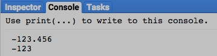


### **TRANSFORMING** [NUMBER](#_top) [VARIABLES](EE13%20%20%20%20%20%20%20%20%20Variables.docx) WITH **LOGICAL** OPERATIONS

number.eq , .neq , .gt , .gte, .lt , and .lte create a new number of 0
or 1 that characterizes a specified relationship between two specified
numbers.

newNumber = 1stNumber.eq( 2ndNumber ) or .neq( ) or .gt( ) or .gte( ) or
.lt( ) or .lte( )

The second specified number

The first specified number

The new number, set to 1 if the specified relationship is true or to 0
if it is false

The specified relationship, questioning whether the first specified
number is equal to (eg), not equal to (neq),

greater than (gt), greater than or equal to (gte), less than (lt), or
less than or equal to (lte) the second.

```js
var FirstNUMBER = ee.Number( 123 );  
var SecondNUMBER = ee.Number( -123 );  
var TruthNUMBER = FirstNUMBER.eq( SecondNUMBER );  
print( FirstNUMBER, SecondNUMBER )  
print('Is it true(1) or false(0) that those two numbers are equal?' );  
print( TruthNUMBER);
```

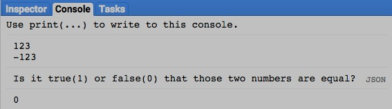

number.and and .or create a new number of 0 or 1 that indicates whether
either or both of two specified numbers are non-zero.

newNumber = 1stNumber.and( 2ndNumber ) or .or( )

The second specified number

The first specified number

The specified relationship, questioning whether

either specified number is non-zero.

The specified relationship, questioning whether

both specified numbers are non-zero.

The new number, set to 1 if the specified relationship is true or to 0
if it is false

```js
var FirstNUMBER = ee.Number( 123 );  
var SecondNUMBER = ee.Number( -123 );  
var TruthNUMBER = FirstNUMBER.eq( SecondNUMBER ).or  
( FirstNUMBER.eq( SecondNUMBER.multiply(-1) ) );  
print( FirstNUMBER, SecondNUMBER );  
print('Is it true(1) or false(0) that the absolute values');  
print('of those two numbers are equal?' );  
print( TruthNUMBER);
```

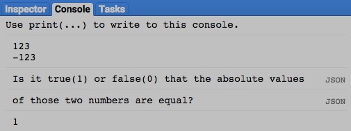

number.not creates a new number of 1 if a specified number is equal to 0
and to 0 if that specified number is not equal to 0.

newNumber = oldNumber.not( )

The new number

The specified number

```js
var OldNUMBER = ee.Number( 123 );  
var TruthNUMBER = OldNUMBER.not( );  
print( OldNUMBER );  
print('Is it true(1) or false(0) that this number is equal to 0?' );  
print( TruthNUMBER );
```

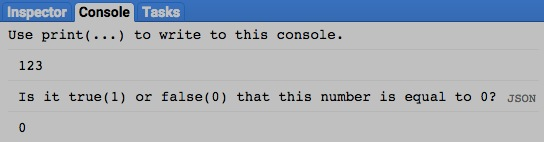

[GOOGLE EARTH ENGINE](EE01%20Earth%20Engine%20\(EE\).docx)
<span class="underline"> </span> [APPLICATION PROGRAMMING
INTERFACE](EE05%20%20%20The%20EE%20API.docx) <span class="underline">
</span> [CAPABILITIES](EE07%20%20%20%20%20%20API%20Capabilities.docx)

### **TRANSFORMING** [NUMBER](#_top) [VARIABLES](EE13%20%20%20%20%20%20%20%20%20Variables.docx) WITH **MATHEMATICAL** OPERATIONS

mathematical function to a specified number.

number.abs , .round , .floor , .ceil , .sqrt , .exp , .log, and .log10
all create a new number by applying a specified

newNumber = oldNumber.abs( ) or .round( ) or .floor( ) or .ceil( ) or
.sqrt( ) or .exp( ) or .log( ) or .log10( )

The specified mathematical function

The new number

The specified number

```js
var OldNUMBER = ee.Number( -724.3352);  
var NewNUMBER = OldNUMBER.floor().abs();  
print ( OldNUMBER, NewNUMBER );
```

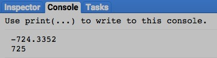


.mod , .pow , .hypot , .first , and .first\_nonzero

all create a new number by applying a specified mathematical function to
two specified numbers.

number.add , .subtract , .multiply , .divide , .max , .min ,

or .mod( ) or .pow( ) or .hypot( ) or .first( ) or .first\_nonzero( )

newNumber = 1stNumber.add( 2ndNumber ) or .subtract( ) or .multiply( )
or .divide( ) or .max( ) or .min( )

The first specified number

The second specified number

The specified mathematical function

The new number

```js
var FirstNUMBER = ee.Number( 12 );  
var SecondNUMBER = ee.Number( 25 );  
var PctCHANGE =
SecondNUMBER.subtract(FirstNUMBER).multiply(100.0).divide(FirstNUMBER);  
print( FirstNUMBER, SecondNUMBER );  
print( 'The 2nd number above represents an increase in the 1st number by
the following %' );  
print( PctCHANGE );
```

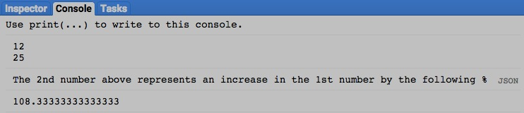


### **TRANSFORMING** [NUMBER](#_top) [VARIABLES](EE13%20%20%20%20%20%20%20%20%20Variables.docx) WITH **TRIGONOMETRIC** OPERATIONS

a specified trigonometric function to a specified number.

number.sin , .cos , .tan , .sinh , .cosh , .tanh , .acos , .asin , and
.atan all create a new number by applying

or .sinh( ) or .cosh( ) or .tanh( ) or .acos( ) or .asin( ) or .atan( )

newNumber = oldNumber.sin( ) or .cos( ) or .tan( )

The new

number

The specified number, assumed to be in radians

The specified trigonometric function

```js
var DegreeNUMBER = 45;  
var RadianNUMBER = ee.Number( DegreeNUMBER / 57.2957795 );  
var TangentNUMBER = RadianNUMBER.tan();  
print( DegreeNUMBER );  
print( RadianNUMBER );  
print( TangentNUMBER );
```

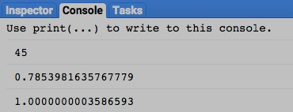


number.atan2 creates a new number by calculating the arctangent (angle
whose tangent matches the ratio of) two specified numbers: numerator
over denominator.

newNumber = 1stNumber.atan2( 2ndNumber )

The specified numerator

The specified denominator

The new number

```js
var FirstNUMBER = ee.Number( 0 );  
var SecondNUMBER = ee.Number( 1 );  
var RadianNUMBER = FirstNUMBER.atan2(SecondNUMBER);  
var DegreeNUMBER = RadianNUMBER.multiply( 57.2957795 );  
print ( RadianNUMBER, DegreeNUMBER );
```

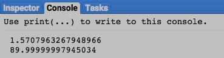


### **TRANSFORMING** [NUMBER](#_top) [VARIABLES](EE13%20%20%20%20%20%20%20%20%20Variables.docx) WITH **BITWISE** OPERATIONS

all create a new number by applying

a specified bitwise function to two specified numbers.

.bitwise\_and , .bitwise\_or , .bitwise\_xor , and .bitwise\_not

number.bitwiseAnd , .bitwiseOr , .bitwiseXor , .bitwiseNot

or .bitwise\_and( ) or .bitwise\_or( ) or .bitwise\_xor( ) or
.bitwise\_not( )

newNumber = 1stNumber.bitwiseAnd( 2ndNumber ) or .bitwiseOr( ) or
.bitwiseXOr( ) or .bitwiseNot( )

The second specified number

The first specified number

The specified bitwise function

The new number

```js
var FirstNUMBER = ee.Number( 1 );  
var SecondNUMBER = ee.Number( 2 );  
var BothBitNUMBER = FirstNUMBER.bitwiseAnd( SecondNUMBER );  
var EitherBitNUMBER = FirstNUMBER.bitwise\_or( SecondNUMBER );  
print ( 'Bitwise 00000001 (=1) and 00000010 (=2) yields 00000000 = ',
BothBitNUMBER );  
print ( 'Bitwise 00000001 (=1) or 00000010 (=2) yields 00000011 = ',
EitherBitNUMBER );
```

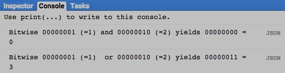

left or right by a specified amount.

number.leftShift , .rightShift , left\_shift , and .right\_shift create
a new number by shifting the bits of a specified number

newNumber = oldNumber.leftShift( numberOfPositions ) or .rightShift( )

The specified amount, given as an integer referring to bit positions

The specified number

The new number

The specified function, indicating whether bits are to be shifted left
or right

```js
var OriginalNUMBER = ee.Number( 8 );  
var LeftwardNUMBER = OriginalNUMBER.leftShift( 1 );  
var RightwardNUMBER = OriginalNUMBER.rightShift( 1 );  
print( 'Left-shifted 8 =', LeftwardNUMBER );  
print( 'Right-shifted 8 =', RightwardNUMBER );
```

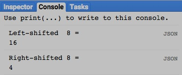


### **COMPARING** [NUMBER](#_top) [VARIABLES](EE13%20%20%20%20%20%20%20%20%20Variables.docx)

ee.Algorithms.IsEqual creates a new Boolean set to True (only) if the
first of two specified numbers is identical to the other in both
structure and content.

The first specified number

newBoolean = ee.Algorithms.IsEqual ( 1stNumber, 2ndNumber )

The second specified number

The new Boolean

```js
var FirstNUMBER = ee.Number( 123 );  
var SecondNUMBER = ee.Number( 123.0 );  
var TrueOrFalse = ee.Algorithms.IsEqual( FirstNUMBER, SecondNUMBER );  
print( FirstNUMBER, SecondNUMBER );  
print('Is it true or false that those two numbers are equal?' );  
print( TrueOrFalse );
```

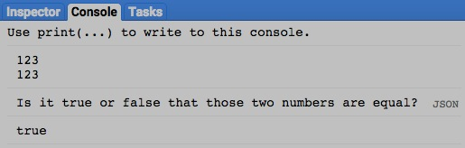


### **DOCUMENTING** [NUMBER](#_top) [VARIABLES](EE13%20%20%20%20%20%20%20%20%20Variables.docx)

ee.Algorithms.Describe , ee.Algorithms.String , and number.getInfo each
creates a JSON-compatible text object

representing a specified number.

ee.Algorithms.String( oldNumber )

newObject = ee.Algorithms.Describe ( oldNumber )

and oldNumber.getInfo( )

The specified number

The new object

```js
var OldNUMBER = ee.Number( 123 );  
print( 'New string from the original number', OldNUMBER );  
print( 'New string from ee.Algorithms.Describe', ee.Algorithms.Describe(
OldNUMBER ) );  
print( 'New string from ee.Algorithms.String', ee.Algorithms.String(
OldNUMBER ) );  
print( 'New string from string.getInfo( )', OldNUMBER.getInfo( ) );
```


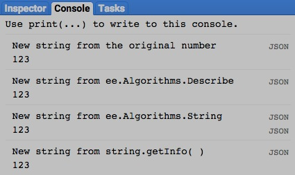

number.toString and .serialize each creates a new string presenting
information on a specified number.

and oldNumber.serialize( )

newString = oldNumber.toString ( )

The specified number

The new string

```js
var OldNUMBER = ee.Number( 123 );  
print( 'New string from the original number', OldNUMBER );  
print( 'New string from string.toString( )', OldNUMBER.toString( ) );  
print( 'New string from string.serialize( )', OldNUMBER.serialize( ) );
```

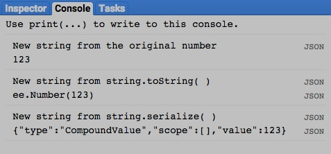


### **PRESENTING** [NUMBER](#_top) [VARIABLES](EE13%20%20%20%20%20%20%20%20%20Variables.docx) IN **PRINT**

print ( number ) and console.log ( number ) present the text
representation of a specified number in the console.

print( oldNumber ) or console.log( oldNumber )

The specified number

```js
print( 123 );  
console.log( 123 );
```

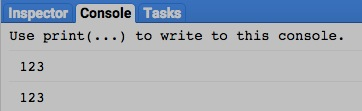


alert ( number ) and confirm( number ) presents the text representation
of a specified number in a pop-up message box.

alert( oldNumber ) or confirm( oldNumber )

The specified number

```js
alert( 123 );  
confirm( 123 );
```


