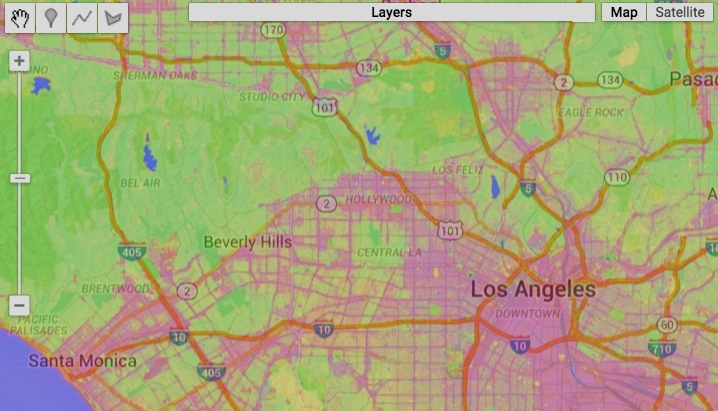

[GOOGLE EARTH ENGINE](EE01%20Earth%20Engine%20\(EE\).docx)
<span class="underline"> </span> [APPLICATION PROGRAMMING
INTERFACE](EE05%20%20%20The%20EE%20API.docx) <span class="underline">
</span> [CAPABILITIES](EE07%20%20%20%20%20%20API%20Capabilities.docx)
<span class="underline">
</span>

## PROCESSING **SATELLITE IMAGERY** [VARIABLES](EE13%20%20%20%20%20%20%20%20%20Variables.docx) 

Earth Engine stores the imagery generated by earth-observing satellites
as images and image collections. As such, satellite imagery can be
processed by using the standard operations available for these types of
object. SatellitE imagery can also be processed, however, by using more
specialized operations of the types listed
below.

| PROCESSING **GENERAL** SATELLITE IMAGERY |                                                     |                                                           |
| ---------------------------------------- | --------------------------------------------------- | --------------------------------------------------------- |
| BY **MOSAICKING** IMAGE COLLECTIONS      | [imageCollection.qualityMosaic](#qualityMosaic)     |                                                           |
| BY MANAGING **CLOUDS AND SHADOWS**       | [ee.Algorithms.FMask.matchClouds](#matchClouds)     |                                                           |
| BY **CLASSIFYING** IMAGES                | [image.unmix ](#unmix)                              |                                                           |
| [image.classify](#classify)              |                                                     |                                                           |
| BY CALCULATING **NORMALIZED DIFFERENCE** | [image.normalizedDifference](#normalizedDifference) |                                                           |
|                                          |                                                     |                                                           |
|                                          |                                                     |                                                           |
| PROCESSING **MODIS** SATELLITE IMAGERY   |                                                     |                                                           |
| BY **DECREASING PIXEL SIZE**             | [ee.Algorithms.SAD.KrigeModis](#KrigeModis)         |                                                           |
|                                          |                                                     |                                                           |
|                                          |                                                     |                                                           |
| PROCESSING **LANDSAT** SATELLITE IMAGERY |                                                     |                                                           |
| BY **LIMITING** IMAGES                   | [Landsat.pathRowLimit](#pathRowLimit)               |                                                           |
| BY **REFORMATTING** METADATA             | [Landsat.translateMetadata](#translateMetadata)     |                                                           |
| BY **CALIBRATING** IMAGES                | [ee.Algorithms.Landsat.TOA](#TOA)                   | [Landsat.calibratedRadiance](#calibratedRadiance)         |
| BY MANAGING **CLOUDS AND SHADOWS**       | [Landsat.simpleCloudScore](#simpleCloudScore)       | [ee.Algorithms.Landsat.simpleComposite](#simpleComposite) |
| BY CALCULATING **REFLECTANCE**           | [Landsat.surfaceReflectance](#surfaceReflectance)   |                                                           |

[GOOGLE EARTH ENGINE](EE01%20Earth%20Engine%20\(EE\).docx)
<span class="underline"> </span> [APPLICATION PROGRAMMING
INTERFACE](EE05%20%20%20The%20EE%20API.docx) <span class="underline">
</span> [CAPABILITIES](EE07%20%20%20%20%20%20API%20Capabilities.docx)
<span class="underline">
</span>

## PROCESSING **GENERAL** [SATELLITE IMAGERY](#_top) [VARIABLES](EE13%20%20%20%20%20%20%20%20%20Variables.docx) 

### BY MOSAICKNG IMAGE COLLECTIONS 

<span id="qualityMosaic" class="anchor"></span>from whichever of those
image is of the highest quality according to the image
collection’squality band.

imageCollection.qualityMosaic creates a new image by combining the
images of an image collection such that each pixel’s value is drawn from

newImage = oldImageCollection.qualityMosaic( qualityBand )

The specified image collection

The specified quality band, given by its name

The new image

> var OldIMAGES =
> ee.ImageCollection('LC8\_L1T\_TOA').filterDate('2014-06-01','2014-07-01')
> 
> .filterBounds(ee.Feature.Rectangle(-109.05, 37.0, -102.05, 41.0) );
> 
> var NewIMAGE = OldIMAGES.qualityMosaic('BQA');
> 
> print( OldIMAGES, NewIMAGE );
> 
> Map.setCenter( -109.05, 37.0, 5 );
> 
> Map.addLayer( NewIMAGE, {'bands':\['B4','B3','B2'\], min:0, max:0.4,
> gamma:1.0 } );
> 
>  

[GOOGLE EARTH ENGINE](EE01%20Earth%20Engine%20\(EE\).docx)
<span class="underline"> </span> [APPLICATION PROGRAMMING
INTERFACE](EE05%20%20%20The%20EE%20API.docx) <span class="underline">
</span> [CAPABILITIES](EE07%20%20%20%20%20%20API%20Capabilities.docx)
<span class="underline">
</span>

## PROCESSING **GENERAL** [SATELLITE IMAGERY](#_top) [VARIABLES](EE13%20%20%20%20%20%20%20%20%20Variables.docx)

### BY MANAGING CLOUDS AND SHADOWS 

<span id="matchClouds" class="anchor"></span>applying the Fmask
algorithm to a specified image using other specified images that depict
potential clouds,

potential shadows, and brightness temperature; as well as coefficients
indicating the upper and lower extents of brightness temperature.

ee.Algorithms.FMask.matchClouds creates a new image with a single band
called ‘csm’ that depicts cloud and shadow masks as computed by

newImage = ee.Algorithms.Fmask.matchClouds

( oldImage, cloudImage, shadowImage, brightnessImage, howDark,
howBright, *tilePadding* )

The specified image

The specified image of brightness

temperatures, given in degrees Celsius

The specified

upper limit

(82.5 percentile)

on brightness

temperature

The specified

lower limit

(17.5th percentile)

on brightness

temperature

The new image

The specified image of potential shadows,

on which cloudy pixels are set to 1 and

non-cloudy pixels are masked.

The specified image of potential clouds,

on which cloudy pixels are set to 1 and

non-cloudy pixels are masked.

The amount by which tiles should be padded,

given in pixel witdths. Default: 50.

var

ADD EXAMPLE

[GOOGLE EARTH ENGINE](EE01%20Earth%20Engine%20\(EE\).docx)
<span class="underline"> </span> [APPLICATION PROGRAMMING
INTERFACE](EE05%20%20%20The%20EE%20API.docx) <span class="underline">
</span> [CAPABILITIES](EE07%20%20%20%20%20%20API%20Capabilities.docx)
<span class="underline">
</span>

## PROCESSING GENERAL [SATELLITE IMAGERY](#_top) [VARIABLES](EE13%20%20%20%20%20%20%20%20%20Variables.docx)

### BY CLASSIFYING IMAGES

<span id="unmix" class="anchor"></span>An endmember is the ideal
“signature” of band-by-band values for a given land cover class.

image.unmix creates a new image on which each band represents one of a
specified set of “endmembers” for a specified multispectral satellite
image.

newImage = oldImage.unmix( arrayOfEndmembers )

The specified endmembers, given as an array doubles

The specified image

The new image

> var MosaickedIMAGE = ee.ImageCollection( 'LT5\_L1T' ).filterDate(
> '2007-06-01','2007-09-30' ).median();
> 
> var EndmemberARRAY = \[
> \[88.0,42.0,48.0,38.0,86.0,115.0,59.0\],
> 
> \[50.0,21.0,20.0,35.0,50.0,110.0,23.0\],
> 
> \[51.0,20.0,14.0, 9.0, 7.0,116.0, 4.0\] \];
> 
> var UnmixedIMAGE = MosaickedIMAGE.unmix( EndmemberARRAY );
> 
> Map.setCenter(-118.274, 34.0514, 11);
> 
> Map.addLayer( MosaickedIMAGE, null, 'Original Image' );
> 
> Map.addLayer( UnmixedIMAGE, {min: 0, max: 1}, 'Unmixed Image' );

// Note that the example above is equivalent to the following

> var MosaickedIMAGE = ee.ImageCollection( 'LT5\_L1T' ).filterDate(
> '2007-06-01','2007-09-30' ).median();
> 
> var ArrayedIMAGE = MosaickedIMAGE.toArray(); //Set each pixel to a 1D
> array of its 7 band values
> 
> var ArrayedIMAGE = ArrayedIMAGE.toArray(1); //Set each pixel to a 2D
> array of its 7x7 band values
> 
> var UrbanARRAY = \[88,42,48,38,86,115,59\]; //Urban endmember
> generated by sampling MosaickedIMAGE
> 
> var VegetARRAY = \[50,21,20,35,50,110,23\]; //Veg endmember generated
> by sampling MosaickedIMAGE
> 
> var WaterARRAY = \[51,20,14, 9, 7,116, 4\]; //Water endmember
> generated by sampling MosaickedIMAGE
> 
> var EndmemberARRAY = ee.Array( \[UrbanARRAY, VegetARRAY, WaterARRAY\]
> );
> 
> var InverseArrayIMAGE = ee.Image(
> EndmemberARRAY.matrixPseudoInverse().transpose() );
> 
> // Set each pixel to 3x1 array of endmembers fractions ranging from 0
> to 1
> 
> var UnmixedArrayIMAGE = InverseArrayIMAGE.matrixMultiply( ArrayedIMAGE
> );
> 
> var Unmixed2dIMAGE = UnmixedArrayIMAGE.arrayProject(\[0\]); //Project
> to axis 0 since axis 1 unnecessary
> 
> var Unmixed1dIMAGE = Unmixed2dIMAGE.arrayFlatten(\[\['urban', 'veg',
> 'water'\]\]); //Flatten to scalar image
> 
> Map.setCenter(-118.274, 34.0514, 11);
> 
> Map.addLayer( MosaickedIMAGE, null, 'Raw Imagery' );
> 
> Map.addLayer( Unmixed1dIMAGE, {min: 0, max: 1}, 'Unmixed (red=urban,
> green=veg, blue=water)' );

[GOOGLE EARTH ENGINE](EE01%20Earth%20Engine%20\(EE\).docx)
<span class="underline"> </span> [APPLICATION PROGRAMMING
INTERFACE](EE05%20%20%20The%20EE%20API.docx) <span class="underline">
</span> [CAPABILITIES](EE07%20%20%20%20%20%20API%20Capabilities.docx)
<span class="underline">
</span>

## PROCESSING **GENERAL** [SATELLITE IMAGERY](#_top) [VARIABLES](EE13%20%20%20%20%20%20%20%20%20Variables.docx)

### BY CLASSIFYING IMAGES

<span id="classify" class="anchor"></span>whose values are generated by
classifying those of the specified image according to a specified
classifier.

image.classify creates a new image by replicating a specified image and
adding to it a new band of a specified name

newImage = oldImage.classify( classifier, newClassificationBandName )

The specified name of the new band, given as a string

The specified classifier

The new image

The specified image, whose band names must be consistent with those
called for by classifier

> var OriginalIMAGE = ee.Image(
> 'LANDSAT/LC8\_L1T\_TOA/LC82320672013207LGN00' );
> 
> var BandSelectedIMAGE = OriginalIMAGE.select(
> \['B2','B3','B4','B5','B6','B7','B10','B11'\] );
> 
> var OriginalFEATURES = ee.FeatureCollection(
> 'ft:10X7SUjDTiFJDyIA58zLcptK8pwBwjj1BV12SQOgJ' );
> 
> var ClassCodedFEATURES = OriginalFEATURES.remap( \[1, 2\], \[0, 1\],
> 'class' );
> 
> var BandCodedFEATURES = BandSelectedIMAGE.sampleRegions(
> ClassCodedFEATURES, \['class'\], 30 );
> 
> var UntrainedCLASSIFIER = ee.Classifier.cart();
> 
> var TrainedCLASSIFIER = UntrainedCLASSIFIER.train(BandCodedFEATURES,
> 'class', \['B2','B3','B4','B5','B6','B7','B10','B11'\]);
> 
> var ClassifiedIMAGE = BandSelectedIMAGE.classify( TrainedCLASSIFIER );
> 
> print( 'Image of All Bands', OriginalIMAGE );
> 
> print( 'Image of Selected Bands',
> BandSelectedIMAGE );
> 
> print( 'Features by Class', ClassCodedFEATURES );
> 
> print( 'Features with Band Properties', BandCodedFEATURES );
> 
> print( 'Untrained Classifier', UntrainedCLASSIFIER );
> 
> print( 'Trained Classifier', TrainedCLASSIFIER );
> 
> Map.centerObject( BandSelectedIMAGE, 8 );
> 
> Map.addLayer( OriginalIMAGE,
> 
> {bands:\['B4','B3','B2'\], max: 0.4}, 'Original Image');
> 
> Map.addLayer( ClassifiedIMAGE,
> 
> {min:0, max:1, palette:\['007700', '999900'\]}, 'Classified Image');
> 
> Map.addLayer( ClassCodedFEATURES,
> 
> {color:'0000ff'}, 'Training Points' );

[GOOGLE EARTH ENGINE](EE01%20Earth%20Engine%20\(EE\).docx)
<span class="underline"> </span> [APPLICATION PROGRAMMING
INTERFACE](EE05%20%20%20The%20EE%20API.docx) <span class="underline">
</span> [CAPABILITIES](EE07%20%20%20%20%20%20API%20Capabilities.docx)
<span class="underline">
</span>

## PROCESSING **GENERAL** [SATELLITE IMAGERY](#_top) [VARIABLES](EE13%20%20%20%20%20%20%20%20%20Variables.docx) 

### BY CALCULATING NORMALIZED DIFFERENCE

<span id="normalizedDifference" class="anchor"></span>on two specified
bands of a specified image divided by the sum of those two values.

image.normalizedDifference creates a new image in which each pixel’s
value is set to the difference between its values

newImage = oldImage.normalizedDifference( bandNameArray )

The specified bands, given as an array of two string naming the bands.
Default: bands 0 and 1

The specified image

The new image

REFINE THIS GOOGLE EXAMPLE

> // Compute Normalized Difference Vegetation Index over MOD09GA
> product.
> 
> // NDVI = (NIR - RED) / (NIR + RED), where
> 
> // RED is sur\_refl\_b01, 620-670nm
> 
> // NIR is sur\_refl\_b02, 841-876nm
> 
> var img = ee.Image('MOD09GA/MOD09GA\_005\_2012\_03\_09');
> 
> var ndvi = img.normalizedDifference(\['sur\_refl\_b02',
> 'sur\_refl\_b01'\]);
> 
> var palette = \['FFFFFF', 'CE7E45', 'DF923D', 'F1B555', 'FCD163',
> '99B718',
> 
> '74A901', '66A000', '529400', '3E8601', '207401', '056201',
> 
> '004C00', '023B01', '012E01', '011D01', '011301'\];
> 
> Map.setCenter(-94.84497, 39.01918, 8);
> 
> Map.addLayer(img.select(\['sur\_refl\_b01', 'sur\_refl\_b04',
> 'sur\_refl\_b03'\]),
> 
> {gain: '0.1, 0.1, 0.1'}, 'MODIS bands 1/4/3');
> 
> Map.addLayer(ndvi, {min: 0, max: 1, palette: palette}, 'NDVI');

[GOOGLE EARTH ENGINE](EE01%20Earth%20Engine%20\(EE\).docx)
<span class="underline"> </span> [APPLICATION PROGRAMMING
INTERFACE](EE05%20%20%20The%20EE%20API.docx) <span class="underline">
</span> [CAPABILITIES](EE07%20%20%20%20%20%20API%20Capabilities.docx)
<span class="underline">
</span>

## PROCESSING **MODIS** [SATELLITE IMAGERY](#_top) [VARIABLES](EE13%20%20%20%20%20%20%20%20%20Variables.docx)

### BY DECREASING PIXEL SIZE 

<span id="KrigeModis" class="anchor"></span>by using covaiance
parameters drawn from a specified feature collection.

ee.Algorithms.SAD.KrigeModis creates a new image by replicating a
specified MODIS image at a finer resolution (from 500 to 250 meters)

newImage = ee.Algorithms.SAD.KrigeModis( oldImage, parameters )

The specified feature collection, given as a geometry with the following
columns:

\- Band (number, 3/4/6/7),

\- Model (string, gaussian/spherical/exponential),

\- Sill (number),

\- Range (number).

For each tile, the first row with an intersecting geometry will be used
for each band.

The specified MODIS image

The new image

var

ADD EXAMPLE

[GOOGLE EARTH ENGINE](EE01%20Earth%20Engine%20\(EE\).docx)
<span class="underline"> </span> [APPLICATION PROGRAMMING
INTERFACE](EE05%20%20%20The%20EE%20API.docx) <span class="underline">
</span> [CAPABILITIES](EE07%20%20%20%20%20%20API%20Capabilities.docx)
<span class="underline"> </span>

PROCESSING **LANDSAT** [SATELLITE IMAGERY](#_top)
[VARIABLES](EE13%20%20%20%20%20%20%20%20%20Variables.docx) BY
**LIMITING** IMAGE COLLECTIONS

<span id="pathRowLimit" class="anchor"></span>after limiting it to only
the best of a specified number of scenes.

ee.Algorithms.Landsat.pathRowLimit creates a new image collection by
replicating a specified Landsat image collection

newImageCollection = ee.Algorithms.Landsat.pathRowLimit(
oldImageCollection, pathLimit, totalLimit )

The specified Landsat image collection

The maximum number

of scenes scenes per

path. Default: 25

The maximum number

of scenes scenes in

total. Default: 100

The new image collection

var

ADD EXAMPLE

[GOOGLE EARTH ENGINE](EE01%20Earth%20Engine%20\(EE\).docx)
<span class="underline"> </span> [APPLICATION PROGRAMMING
INTERFACE](EE05%20%20%20The%20EE%20API.docx) <span class="underline">
</span> [CAPABILITIES](EE07%20%20%20%20%20%20API%20Capabilities.docx)
<span class="underline">
</span>

## PROCESSING LANDSAT [SATELLITE IMAGERY](#_top) [VARIABLES](EE13%20%20%20%20%20%20%20%20%20Variables.docx) 

### BY REFORMATTING METADATA 

<span id="translateMetadata" class="anchor"></span>after reconfiguring
its metadata to the most recent format.

ee.Algorithms.Landsat.translateMetadata creates a new image by
replicating a specified Landsat image

newImage = ee.Algorithms.Landsat.translateMetadata( oldImage )

The specified Landsat image

The new image

var

ADD EXAMPLE

**  
**

[GOOGLE EARTH ENGINE](EE01%20Earth%20Engine%20\(EE\).docx)
<span class="underline"> </span> [APPLICATION PROGRAMMING
INTERFACE](EE05%20%20%20The%20EE%20API.docx) <span class="underline">
</span> [CAPABILITIES](EE07%20%20%20%20%20%20API%20Capabilities.docx)
<span class="underline">
</span>

## PROCESSING **LANDSAT** [SATELLITE IMAGERY](#_top) [VARIABLES](EE13%20%20%20%20%20%20%20%20%20Variables.docx)

### BY CALIBRATING IMAGES 

<span id="TOA" class="anchor"></span>after recalibrating its
top-of-atmosphere (TOA) reflectance and brightness temperature values.

ee.Algorithms.Landsat.TOA creates a new image by replicating a specified
Landsat 4, 5, 7, or 8 image after recalibrating

newImage = ee.Algorithms.Landsat.TOA( oldImage )

The specified Landsat image

The new image

REFINE THIS GOOGLE EXAMPLE

> // Compare MSS images from L1 through L5
> 
> var sfPoint = ee.Geometry.Point(-122.223, 37.892);
> 
> Map.setCenter(-122.223, 37.892, 10);
> 
> for (var i = 1; i \<= 5; ++i) {
> 
> var collection = ee.ImageCollection('LM' + i + '\_L1T');
> 
> var image = ee.Image(collection.filterBounds(sfPoint).first());
> 
> var toa = ee.Algorithms.Landsat.TOA(image);
> 
> var date = ee.Date(image.get('system:time\_start')).format('MMM
> yyyy');
> 
> var bands = (i \<= 3) ? \['B6', 'B5', 'B4'\] : \['B3', 'B2', 'B1'\];
> 
> // This is one of the rare places where we need to use getInfo() in
> the
> 
> // middle of a script, since layer names must be client-side strings.
> 
> var label = 'Landsat' + i + ' (' + date.getInfo() + ')';
> 
> Map.addLayer(toa, {bands: bands, min: 0, max: 0.4}, label);
> 
> }

[GOOGLE EARTH ENGINE](EE01%20Earth%20Engine%20\(EE\).docx)
<span class="underline"> </span> [APPLICATION PROGRAMMING
INTERFACE](EE05%20%20%20The%20EE%20API.docx) <span class="underline">
</span> [CAPABILITIES](EE07%20%20%20%20%20%20API%20Capabilities.docx)
<span class="underline">
</span>

## PROCESSING **LANDSAT** [SATELLITE IMAGERY](#_top) [VARIABLES](EE13%20%20%20%20%20%20%20%20%20Variables.docx) 

## BY CALIBRATING IMAGES 

<span id="calibratedRadiance" class="anchor"></span>its bands according
to the ‘calibration\_gain’ and ‘calibration\_gain’ properties of that
band.

ee.Algorithms.Landsat.calibratedRadiance creates a new image by
replicating a specified Landsat image after recalibrating each of

newImage = ee.Algorithms.Landsat.calibratedRadiance( oldImage )

The specified Landsat image

The new image

var

ADD EXAMPLE

[GOOGLE EARTH ENGINE](EE01%20Earth%20Engine%20\(EE\).docx)
<span class="underline"> </span> [APPLICATION PROGRAMMING
INTERFACE](EE05%20%20%20The%20EE%20API.docx) <span class="underline">
</span> [CAPABILITIES](EE07%20%20%20%20%20%20API%20Capabilities.docx)
<span class="underline"> </span>

PROCESSING **LANDSAT** [SATELLITE IMAGERY](#_top)
[VARIABLES](EE13%20%20%20%20%20%20%20%20%20Variables.docx)

### BY MANAGING CLOUDS AND SHADOWS 

<span id="simpleCloudScore" class="anchor"></span>each pixel is set to a
value raning from 0 through 100 to indicate to indicate the percent
likelihood

that the pixel is part of a cloud.

ee.Algorithms.Landsat.simpleCloudScore creates a new image by
replicating a specified Landsat image after adding to it a band on which

newImage = ee.Algorithms.Landsat.simpleCloudScore( oldImage )

The specified Landsat image

The new image

> var TheALGORITHM = function ( TypicalIMAGE )
> 
> {var TheIMAGE = TypicalIMAGE.select(
> \['B2','B3','B4','B5','B6','B7','B10','B11'\] );
> 
> var OldScore = ee.Algorithms.Landsat.simpleCloudScore( TheIMAGE );
> 
> var NewScore = ee.Image( 1 ).subtract( OldScore ).select( \[0\],
> \['cloudscore'\] );
> 
> return TypicalIMAGE.addBands( NewScore );
> 
> };
> 
> var OldIMAGES =
> ee.ImageCollection('LC8\_L1T\_TOA').filterDate('2013-05-01',
> '2013-06-01');
> 
> var NewIMAGES = OldIMAGES.map( TheALGORITHM );
> 
> var NewIMAGE = NewIMAGES.qualityMosaic('cloudscore');
> 
> Map.setCenter(-120.24487, 37.52280, 9);
> 
> Map.addLayer( OldIMAGES, {'bands':\['B4','B3','B2'\], 'max':0.4,
> 'gamma':1.6}, 'Original Image Collection' );
> 
> Map.addLayer( NewIMAGE, {'bands':\['B4','B3','B2'\], 'max':0.4,
> 'gamma':1.6}, 'Less Cloudy Mosaicked Image');
> 
> 

[GOOGLE EARTH ENGINE](EE01%20Earth%20Engine%20\(EE\).docx)
<span class="underline"> </span> [APPLICATION PROGRAMMING
INTERFACE](EE05%20%20%20The%20EE%20API.docx) <span class="underline">
</span> [CAPABILITIES](EE07%20%20%20%20%20%20API%20Capabilities.docx)
<span class="underline"> </span>

PROCESSING **LANDSAT** [SATELLITE IMAGERY](#_top)
[VARIABLES](EE13%20%20%20%20%20%20%20%20%20Variables.docx) BY MANAGING
**CLOUDS AND SHADOWS**

<span id="simpleComposite" class="anchor"></span>computing cloud scores,
and limiting it to the least cloudy scenes as defined by specified
parameters.

ee.Algorithms.Landsat.simpleComposite creates a new image by replicating
a specified Landsat image collection after recalibrating its scenes,

newImage = ee.Algorithms.Landsat.simpleComposite

( oldImageCollection*, percentileLimit, cloudScoreRangeLimit,
scenesLimit, floatingPoint?* )

A Boolean set to true (only)

if output is to employ the same

units as Landsat.TOA operation.

Otherwise, they are integers.

Default: false

The maximum acceptable

range of cloud scores per

pixel, given as an integer.

Default: 10

The specified Landsat image collection

The new image

The percentile limit on acceptable cloud scores, given as an integer.
Default: 50

The (approximate) limit on how many scenes are to be considered for any
one pixel, given as an integer. Default: 40

> var OldIMAGES =
> ee.ImageCollection('LANDSAT/LC8\_L1T').filterDate('2015-1-1',
> '2015-5-1');
> 
> var NewIMAGE = ee.Algorithms.Landsat.simpleComposite( OldIMAGES, 50,
> 10, 40, true );
> 
> Map.setCenter( -66.4261, 18.2505, 9 );
> 
> Map.addLayer( NewIMAGE, {bands: 'B7,B6,B1', max:
> \[0.3, 0.4, 0.3\]});
> 
> [GOOGLE EARTH ENGINE](EE01%20Earth%20Engine%20\(EE\).docx)
> <span class="underline"> </span> [APPLICATION PROGRAMMING
> INTERFACE](EE05%20%20%20The%20EE%20API.docx) <span class="underline">
> </span> [CAPABILITIES](EE07%20%20%20%20%20%20API%20Capabilities.docx)
> <span class="underline"> </span>

PROCESSING **LANDSAT** [SATELLITE IMAGERY](#_top)
[VARIABLES](EE13%20%20%20%20%20%20%20%20%20Variables.docx)

### BY CALCULATING REFLECTANCE 

its surface reflectance on a specified Landsat image as calculated by
the LEDAPS
method.

<span id="surfaceReflectance" class="anchor"></span>ee.Algorithms.Landsat.surfaceReflectance
creates a new image in which each pixel is set to a value of from 0
through 10000 to indicate

newImage = ee.Algorithms.Landsat.surfaceReflectance( oldImage,
LEPAPSImage, …

A LEDAPS information scene

The specified iLandsat mage

The new image

… surfaceWvImages, seaLevelPressureImages, surfaceTempImages,
ozoneImage, elevationImage)

Four NCEP\_RE surface wv images for the day of the scene, given as a

list of name strings.

Four NCEP\_RE

sea-level pressure images for the day of the scene, given as a list of
name strings.

Four NCEP\_RE surface temperature images for the day of the scene, given
as a list of name strings.

A (TOMS)

ozone image.

A topographic

elevation image.

REFINE THIS GOOGLE EXAMPLE

```js
var scene = ee.Image('LE7\_L1T/LE70230391999217GNC00');  
  
// The LEDAPS precomputed image products for our scene of interest.  
var precomputed = ee.Image('LEDAPS/L7\_PRE/LE70230391999217GNC00');  
  
// Ancillary data.  
var surfaceWv =
\[ee.Image('NCEP\_RE/surface\_wv/pr\_wtr\_eatm\_1999080500'),  
ee.Image('NCEP\_RE/surface\_wv/pr\_wtr\_eatm\_1999080506'),  
ee.Image('NCEP\_RE/surface\_wv/pr\_wtr\_eatm\_1999080512'),  
ee.Image('NCEP\_RE/surface\_wv/pr\_wtr\_eatm\_1999080518')\];  
var pressure =
\[ee.Image('NCEP\_RE/sea\_level\_pressure/slp\_1999080500'),  
ee.Image('NCEP\_RE/sea\_level\_pressure/slp\_1999080506'),  
ee.Image('NCEP\_RE/sea\_level\_pressure/slp\_1999080512'),  
ee.Image('NCEP\_RE/sea\_level\_pressure/slp\_1999080518')\];  
var surfaceTemp =
\[ee.Image('NCEP\_RE/surface\_temp/air\_sig995\_1999080500'),  
ee.Image('NCEP\_RE/surface\_temp/air\_sig995\_1999080506'),  
ee.Image('NCEP\_RE/surface\_temp/air\_sig995\_1999080512'),  
ee.Image('NCEP\_RE/surface\_temp/air\_sig995\_1999080518')\];  
var ozone = ee.Image('TOMS/MERGED/L3\_ozone\_epc\_19990805');  
var dem = ee.Image('srtm90\_v4');  
  
// Compute the Surface Reflectance result using default auxilary data.  
var ee\_sr = ee.Algorithms.Landsat.surfaceReflectance(  
scene,  
precomputed,  
surfaceWv,  
pressure,  
surfaceTemp,  
ozone,  
dem);  
  
Map.setCenter(-90.7945, 30.0958, 11);  
  
// Surface reflectance is a unitless ratio scaled to the range 0-10000  
// and typically less than 2000.  
Map.addLayer(ee\_sr, {min: 0, max: 2000}, 'EE Surface Reflectance');  
  
// The "QA" band has various flags encoded in different bits. We
extract  
// some of them as individual mask bands.  
// QA Bit 2: Invalid pixel indicator.  
// QA Bit 3: Cloud indicator.  
// QA Bit 5: Water indicator. (0 == water).  
// QA Bit 6: Pixel used as "dense dark vegetation"  
  
var invalid = ee\_sr.select('QA').bitwiseAnd(2).neq(0);  
invalid = invalid.mask(invalid);  
  
var cloud = ee\_sr.select('QA').bitwiseAnd(4).neq(0);  
cloud = cloud.mask(cloud);  
  
// This flag is technically a "not water" flag, so we check for it  
// being unset (eq(0)) instead of set (neq(0)).  
var water = ee\_sr.select('QA').bitwiseAnd(32).eq(0);  
water = water.mask(water);  
  
var dense\_dark\_vegetation =
ee\_sr.select('QA').bitwiseAnd(64).neq(0);  
dense\_dark\_vegetation =
dense\_dark\_vegetation.mask(dense\_dark\_vegetation);  
  
// Show various bits from the QA Mask Band.  
Map.addLayer(invalid, {palette: '000000,ff0000'}, 'Invalid');  
Map.addLayer(cloud, {palette: '000000,ffffff'}, 'Cloud');  
Map.addLayer(water, {palette: '000000,0000ff'}, 'Not Land');  
Map.addLayer(dense\_dark\_vegetation, {palette: '000000,00ff00'},  
'Dense Dark Vegetation');
```
